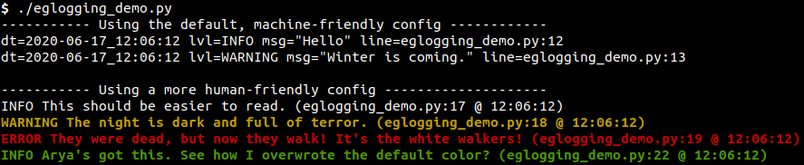

# eglogging
Super-simple wrapper around python's logging library



To use it, import everything: `from eglogging import *`

You can then log a message `m` using these functions,
in order of increasing importance:

    DEBUG(m), INFO(m), MSG(m), WARN(m), ERROR(m), CRITICAL(m)

Note that `MSG(m)` is actually exactly the same as `INFO(m)`; it's provided for backwards-compatibility.

By default, configuration is loaded from `logger_config_DEFAULT.json`,
where the output will be formatted to
[logfmt](https://brandur.org/logfmt).

To load another configuration, just call `logging_load_config_from_file(fn)`,
where `fn` is the path to a json file containing a valid configuration.

A human-friendly configuration is provided in `logger_config_HUMAN.json`.
In this config, WARNINGs and higher-level messages will be colored by default.
You can also set the color of any message manually by providing a color argument:

```
INFO("Arya's got this. See how I overwrote the default color?",
     color = LOG_COLORS['GREEN'])
```

The available colors are `BLACK`, `RED`, `GREEN`, `YELLOW`, `BLUE`, `MAGENTA`, `CYAN`, `WHITE`, `BLACK_BG`, `RED_BG`, `GREEN_BG`, `YELLOW_BG`, `BLUE_BG`, `MAGENTA_BG`, `CYAN_BG`, and `WHITE_BG`.

For more info on how to set up a custom formatter / configuration, look
[here](https://docs.python.org/3/library/logging.config.html#logging-config-dictschema).
